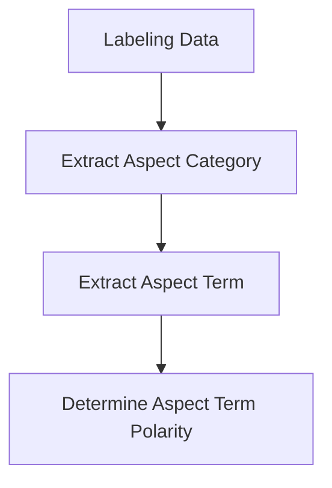
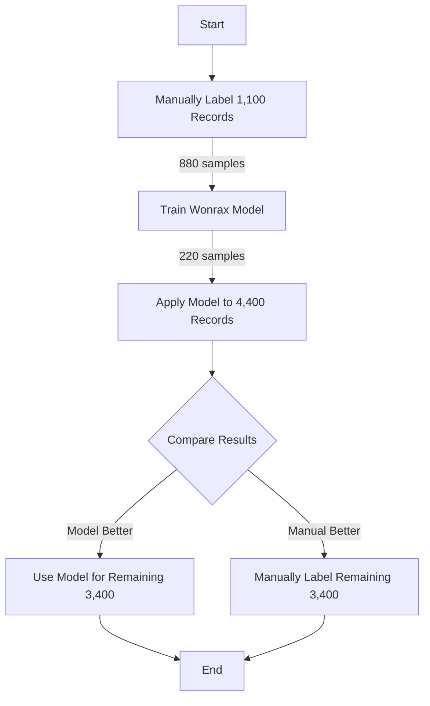
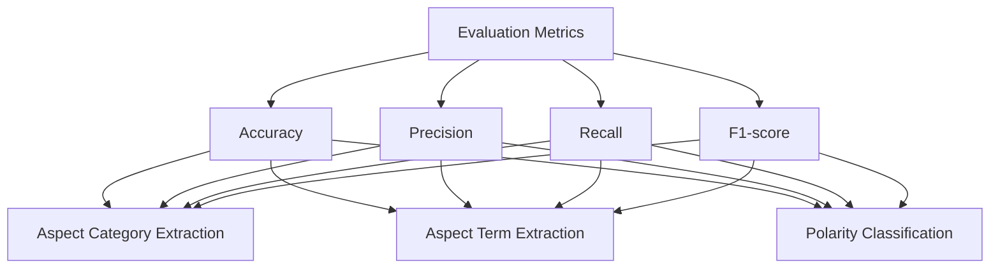

# ABSA Modeling

## 1. Introduction

This document outlines my approach for Aspect-Based Sentiment Analysis (ABSA) modeling on a Vietnamese feedback dataset. The goal is to develop a robust model capable of extracting aspect categories, aspect terms, and determining the polarity of each aspect term.

## 2. Dataset Overview

- Total dataset size: 22,000 records
- Development subset: 4,400 records (20% of total dataset)

## 3. Methodology

My ABSA pipeline consists of the following steps:

<antArtifact identifier="absa-pipeline-flowchart" type="application/vnd.ant.mermaid" title="ABSA Pipeline Flowchart">

### 3.1 Data Labeling

I will employ two approaches for data labeling:

#### 3.1.1 Manual Labeling

- Number of records: 1,100
- Includes: Aspect categories and aspect terms
- Seed: 15 (for reproducibility)

#### 3.1.2 Model-based Labeling

- Model: Wonrax
- Training data: Initial 1,100 manually labeled records
- Application: 4,400 records (development subset)
- Seed: 15 (for reproducibility)

#### 3.1.3 Comparison and Decision

I will compare the results of manual and model-based labeling to evaluate the model's performance. The decision on which method to use for the remaining data will be based on the reported accuracy.

#### 3.1.4 Labeling Remaining Data

The chosen method (manual or model-based) will be used to label the remaining 3,400 records in the development subset.

### 3.2 Aspect Category and Term Extraction

The aspect categories and terms will be extracted during the labeling process, whether done manually or by the model.

### 3.3 Aspect Term Polarity Determination

- Model: Wonrax
- Task: Classify aspect term polarity as NEG (Negative), NEU (Neutral), or POS (Positive)
- Training data: Labeled data from previous steps

## 4. Implementation Plan

1. Prepare the development subset (4,400 records)
2. Manually label 1,100 records
3. Train the Wonrax model on the 1,100 samples 
4. Choose the best-performing method based on accuracy
5. Label the remaining 3,300 records using the chosen method
6. Train the Wonrax model for aspect term polarity classification
7. Evaluate the final model's performance

## 5. Evaluation Metrics

- Accuracy: Overall correct predictions / Total predictions
- Precision: True Positives / (True Positives + False Positives)
- Recall: True Positives / (True Positives + False Negatives)
- F1-score: 2 * (Precision * Recall) / (Precision + Recall)

These metrics will be calculated for aspect category extraction, aspect term extraction, and polarity classification.

## 6. Expected Outcomes

1. A labeled dataset of 4,400 Vietnamese feedback records
2. An ABSA model capable of:
   - Extracting aspect categories
   - Extracting aspect terms
   - Determining aspect term polarity
3. Performance metrics for each stage of the ABSA pipeline
4. Insights into the effectiveness of manual vs. model-based labeling for this specific task

## 7. Limitations and Future Work

- The current approach uses only 20% of the available data. Future work could involve scaling the model to the full 22,000 record dataset.
- The performance of the Wonrax model on Vietnamese feedback data should be compared with other state-of-the-art models for potential improvements.
- Additional data augmentation techniques could be explored to enhance model performance, especially for underrepresented categories or sentiments.

## 8. Conclusion

This ABSA modeling approach for Vietnamese feedback data combines manual and automated methods to create a robust model. By comparing different labeling techniques and focusing on a manageable subset of data, I aim to develop an effective ABSA system that can be later scaled to the full dataset.
</antArtifact>