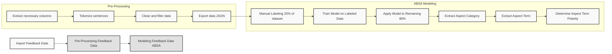

# Aspect-Based Sentiment Analysis (ABSA) for Vietnamese Text

## Process Overview



## Detailed Steps

### 1. Import Feedback Data
- Load data from CSV file
- Remove duplicates based on 'GeneralFeedbackID'
- Convert 'Content' to string type

### 2. Pre-Processing Feedback Data
a. Extract necessary columns

b. Tokenize sentences
   - Split text by commas and periods
   - Clean each segment

c. Clean and filter data
   - Remove URLs, HTML tags, special characters, hashtags, phone numbers
   - Check for meaningful content (length, repetition, pattern criteria)

d. Export data as JSON

### 3. Modeling Feedback Data (ABSA)
a. Manual Labeling (20% of dataset)

b. Extract Aspect Category
   - E.g., "Về Sản Phẩm", "Về Dịch Vụ"

c. Extract Aspect Term
   - E.g., For "Về Sản Phẩm": màn hình, loa
   - E.g., For "Về Dịch Vụ": giao hàng

d. Determine Aspect Term Polarity
   - Use wonrax/phobert-base-vietnamese-sentiment model
   - Classify as NEG, NEU, or POS

## Example

Input:
```
Màn hình rất tốt, loa rất hay nhưng giao hàng chậm
```

Tokenized and Manual Labeling:
```json
{
  "GeneralFeedbackID": "19179222",
  "Content": "Màn hình rất tốt, loa rất hay nhưng giao hàng chậm",
  "Aspects": [
    {
      "AspectCategory": "Về Sản Phẩm",
      "AspectTerms": "màn hình"
    },
    {
      "AspectCategory": "Về Sản Phẩm",
      "AspectTerms": "loa"
    },
    {
      "AspectCategory": "Về Dịch Vụ",
      "AspectTerms": "giao hàng"
    }
  ]
}
```

Output:
```json
{
  "GeneralFeedbackID": "19179222",
  "Content": "Màn hình rất tốt, loa rất hay nhưng giao hàng chậm",
  "Aspects": [
    {
      "AspectCategory": "Về Sản Phẩm",
      "AspectTerms": "màn hình",
      "Polarity": "POS",
      "DominantScore": 0.95
    },
    {
      "AspectCategory": "Về Sản Phẩm",
      "AspectTerms": "loa",
      "Polarity": "POS",
      "DominantScore": 0.92
    },
    {
      "AspectCategory": "Về Dịch Vụ",
      "AspectTerms": "giao hàng",
      "Polarity": "NEG",
      "DominantScore": 0.78
    }
  ]
}
```