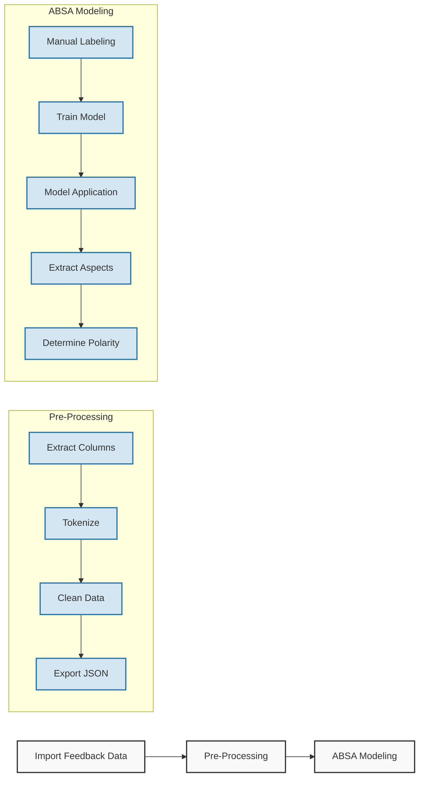
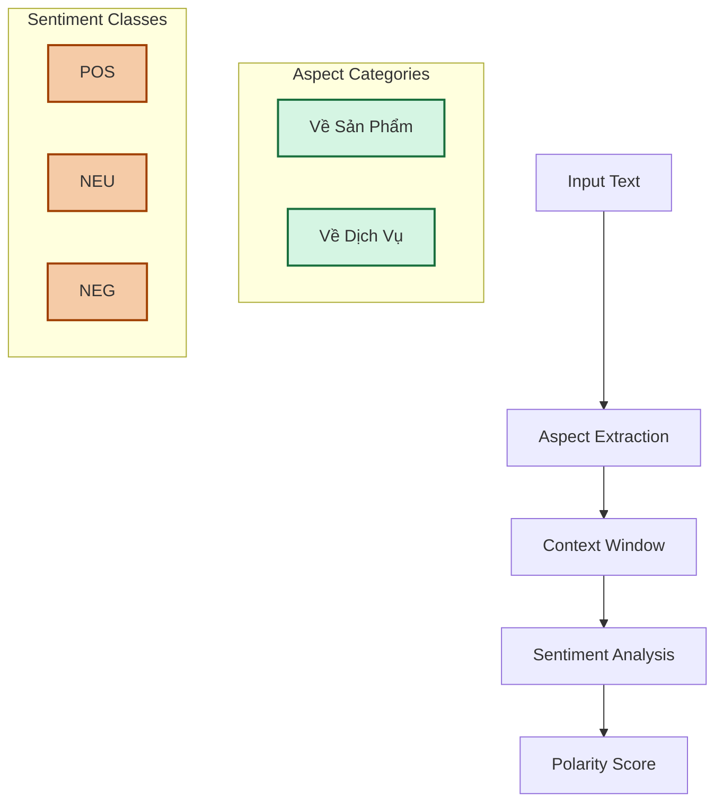
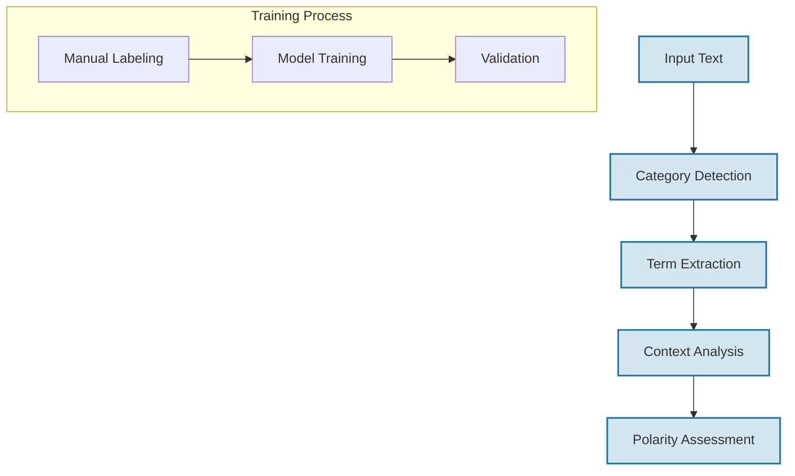

# Vietnamese E-commerce Feedback Analysis Model

## Contact
For technical questions or support, please contact:
- Kiet Nguyen
- [WhatsApp](https://wa.me/84914852966)

## Introduction
This repository contains an advanced Aspect-Based Sentiment Analysis (ABSA) model specifically designed for Vietnamese e-commerce feedback analysis. The model employs state-of-the-art natural language processing techniques to extract meaningful insights from customer reviews, enabling granular understanding of product and service sentiment.

## Model Architecture

### Processing Pipeline



### Sentiment Analysis Flow



## Implementation Details

### 1. Data Processing
Our model implements sophisticated text processing:
- Vietnamese-specific tokenization
- Context window extraction
- Noise removal and normalization
- Special character handling

### 2. Aspect Extraction
The system uses a two-stage approach:



### 3. Model Components

#### Dataset Characteristics
- Total size: 22,000 records
- Development set: 4,400 records (20%)
- Training set: 1,100 records manually labeled

#### Training Approach
- Initial manual labeling of seed dataset
- Model training on labeled data
- Iterative refinement process
- Performance validation

## Repository Structure
```
MODEL_FLEXIBOARD/
├── document/              # Technical documentation
├── vincorenpl/            # Core NLP components
│   ├── checkpoint-30800/  # Model checkpoints
│   └── sample_data/       # Training samples
├── warehouse/             # Processed data
└── inference.py           # Model inference
```

## Example Output

```json
{
  "Content": "Màn hình rất tốt, loa rất hay nhưng giao hàng chậm",
  "Aspects": [
    {
      "Category": "Về Sản Phẩm",
      "Term": "màn hình",
      "Polarity": "POS",
      "Confidence": 0.95
    },
    {
      "Category": "Về Dịch Vụ",
      "Term": "giao hàng",
      "Polarity": "NEG",
      "Confidence": 0.78
    }
  ]
}
```

## Important Note
This model has been developed and trained by Kiet Nguyen for educational purposes. The training data and pre-trained models are intended for academic use only and should not be used for commercial purposes without proper authorization.

## License
This project is licensed under the MIT License - see the LICENSE file for details.